# opKapot: Uninstaller & Security

An advanced uninstaller, disk cleaner and PC security suite for Windows. It removes programs and Windows apps in bulk, wipes their leftovers, finds large and duplicate files and cleans junk. It also scans for viruses and checks whether anyone is spying on, controlling or getting into your PC.

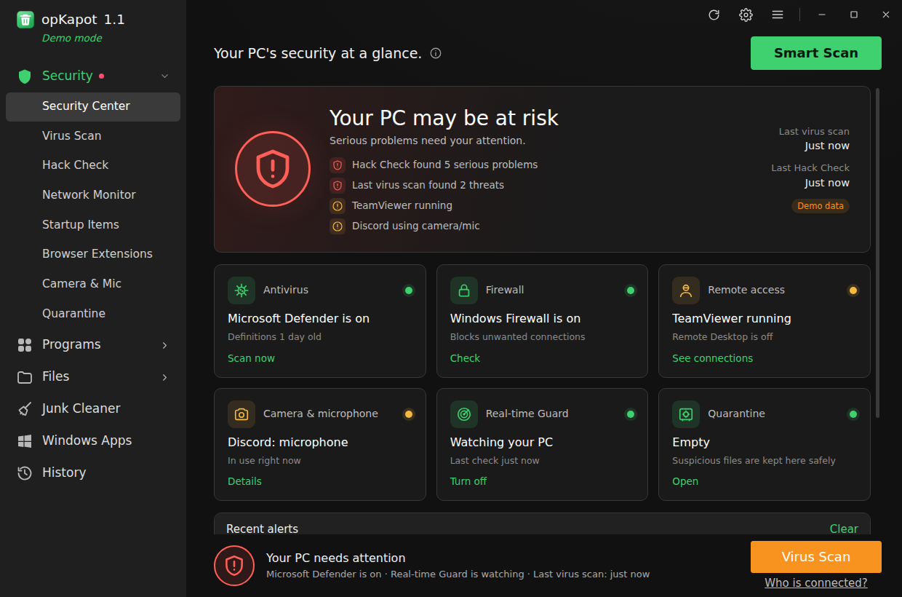

## Security

Open **Security** in the sidebar. **Smart Scan** runs a Hack Check and a quick virus scan together.

### Virus Scan
- **Two engines at once.** opKapot drives **Microsoft Defender's** engine, which is built into Windows, updated several times a day and scores near the top in independent AV-TEST and AV-Comparatives tests. At the same time it runs **its own checks** for the tricks malware uses:
  - programs disguised as documents (`Invoice.pdf.exe`, right-to-left-override names, a `.pdf` that is really an `.exe`);
  - fake Windows files (`svchost.exe` outside `C:\Windows`);
  - scripts that download and run code, hide encoded PowerShell, switch off Defender or AMSI, or delete your backups (a ransomware pattern);
  - booby-trapped shortcuts and `.url`/`.reg` files, programs dropped in the Startup folder, and ransom notes.
- **Quick scan** covers Downloads, Desktop, Documents, startup folders, Temp and AppData. **Full scan** covers every drive. **Custom scan** takes any folder you pick.
- **Quarantine** locks a suspicious file away. It is scrambled so it can't run, and you can restore it later.
- **VirusTotal** (optional, with a free API key): checks a file against 70+ antivirus engines. Only the file's SHA-256 fingerprint is sent, never the file.
- **Protection history** lists everything Defender has ever caught. **Update definitions**, **Remove threats** and the **Defender Offline** rootkit scan are one click each.

### Hack Check: is anyone getting into your PC?
A read-only audit that explains every finding in plain words. Anything it can fix gets a **Fix** button, and registry changes are backed up to a `.reg` file first.

| Area | What it looks for |
|---|---|
| **Remote access** | Remote-control apps (TeamViewer, AnyDesk, RustDesk, ScreenConnect, and more), Remote Desktop and Remote Assistance being on, active remote sessions, sign-ins from other computers, failed password attempts, router ports forwarded to your PC (UPnP), programs that accept connections from the internet |
| **Keyloggers & spyware** | Keyboard filter drivers, known keyloggers and stalkerware, DLL-injection hooks (AppInit, Winlogon Shell/Userinit, LSA packages, IFEO debuggers, silent-exit monitors), plain-text password storage (WDigest), apps using your camera or microphone right now |
| **Startup & hidden programs** | Run keys, Startup folders, scheduled tasks, services, drivers and hidden **WMI** tasks, with digital-signature checks. Unsigned programs in Temp or AppData, hidden or encoded PowerShell and script hosts are flagged |
| **Browsers** | Extensions in Chrome, Edge, Brave, Opera, Vivaldi and Firefox. Force-installed or sideloaded extensions, policy hijacks (homepage, search, proxy), and what each extension can read |
| **Internet & network** | Proxy settings, DNS servers, the hosts file (blocked security sites, redirected banking or login sites), fake root certificates that let someone read HTTPS traffic |
| **Windows protection** | Antivirus and firewall state, Defender exclusions that hide folders from scanning, Tamper Protection, UAC, SmartScreen, Windows Update |
| **Accounts & sharing** | New admin accounts, the Guest account, shared folders, who is connected to your shares, SMBv1 |

### Network Monitor
A live table of every connection and open port, showing **which program owns it**, whether it's **incoming** (another device connected to you) or outgoing, and where the other side is. Filter by Internet, Incoming, Listening or Flagged, look up an IP address, **block a program** in Windows Firewall, or end it.

### Startup Items, Browser Extensions, Camera & Mic
- **Startup Items**: everything that starts with Windows, with publisher, signature and risk. Disable, enable or remove items.
- **Browser Extensions**: every extension in every browser profile, with what it can do and how it was installed.
- **Camera & Mic**: which apps used your camera, microphone and location, when, and for how long. A red banner shows anything using them **right now**.

### Real-time Guard
While opKapot runs (it can sit in the tray and start with Windows), the Guard checks your PC every 30 seconds and alerts you when:
- an app starts using your **camera or microphone**;
- a device on the **internet connects to your PC**, or a program opens a new port;
- a **remote-control tool** starts, or someone signs in with **Remote Desktop**;
- a new **startup program**, Startup-folder file or scheduled task appears;
- **Microsoft Defender** catches something.

### What it can and can't do
opKapot is honest about its limits. Microsoft Defender's engine does the signature scanning. opKapot does not ship its own virus database. Keylogger detection finds the ways keyloggers hook into Windows (drivers, hooks, startup entries, known products), but no tool can promise to catch every custom keylogger. If Hack Check finds something serious, or you believe someone has control of your PC, disconnect from the internet, change your passwords **from a different device**, and consider a clean Windows reinstall.

| | |
|---|---|
| 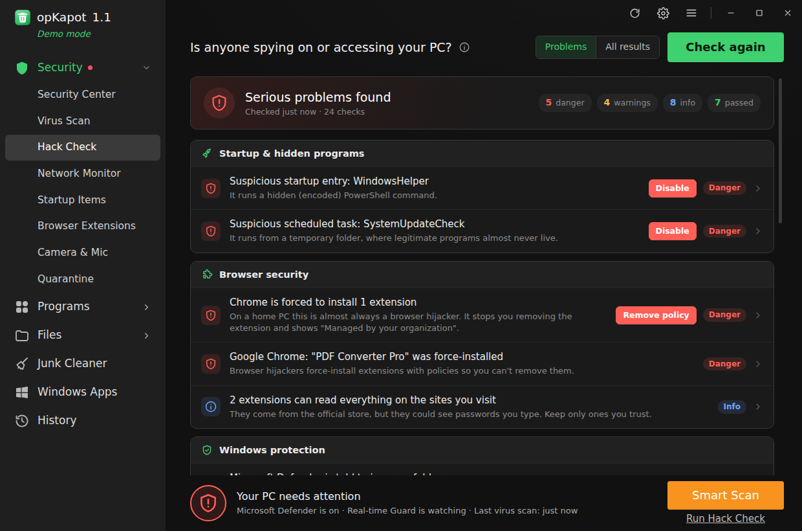 | 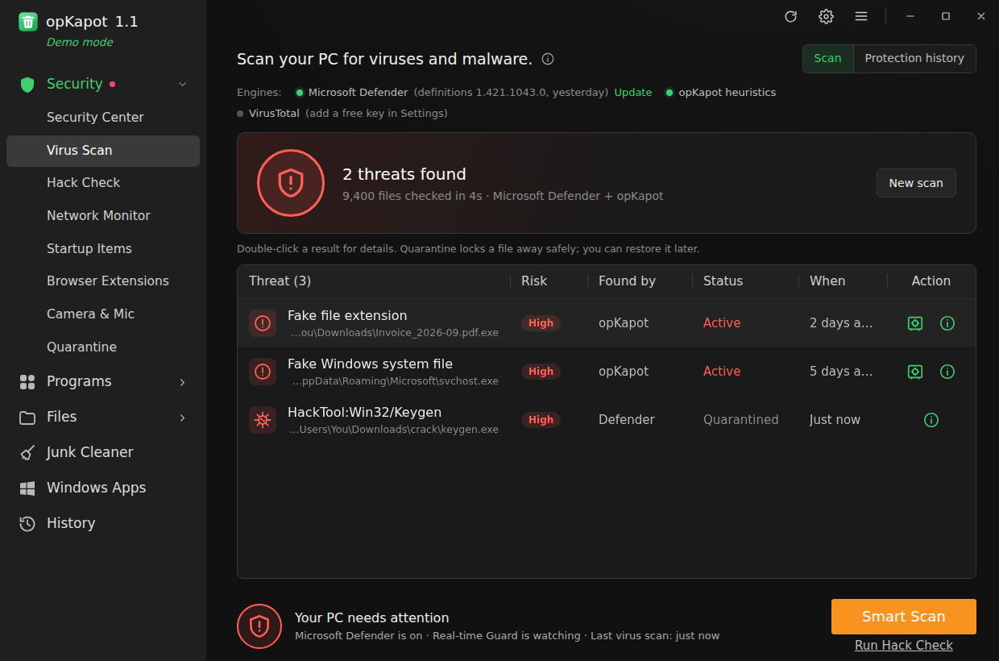 |
| 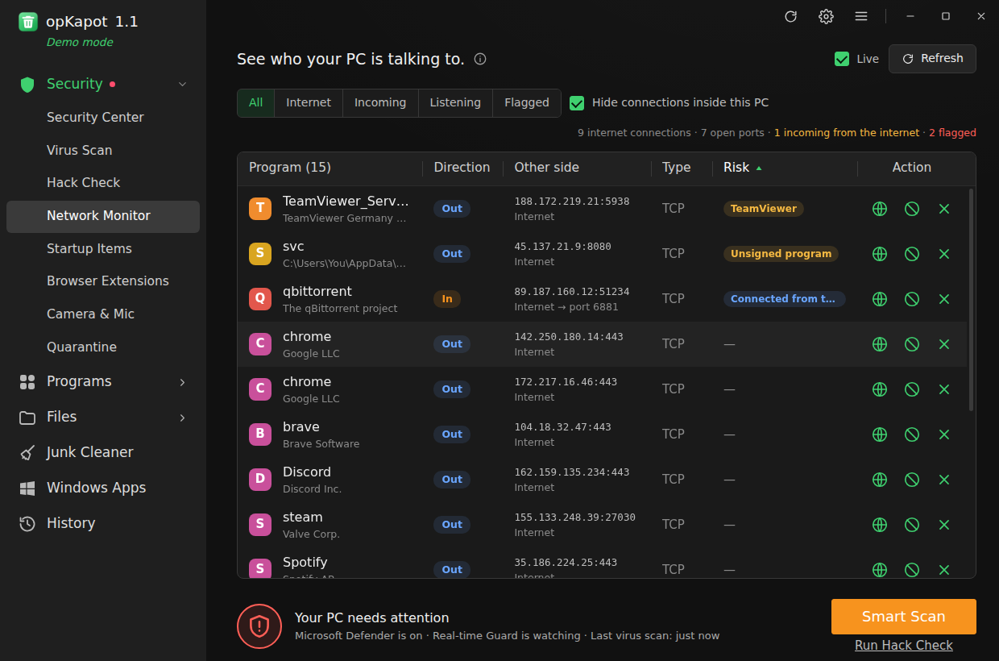 | 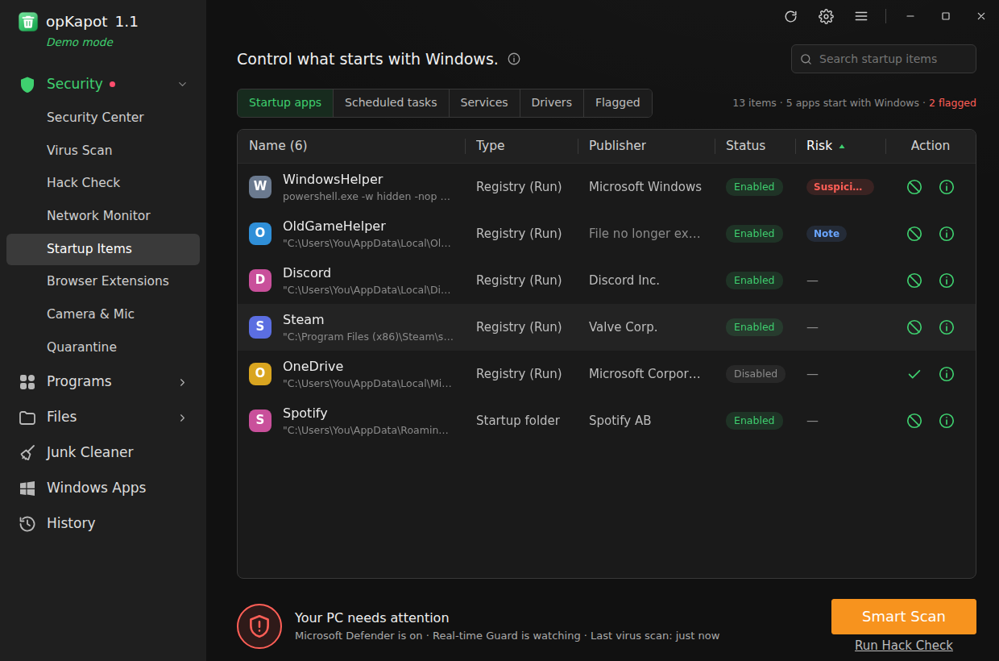 |
| 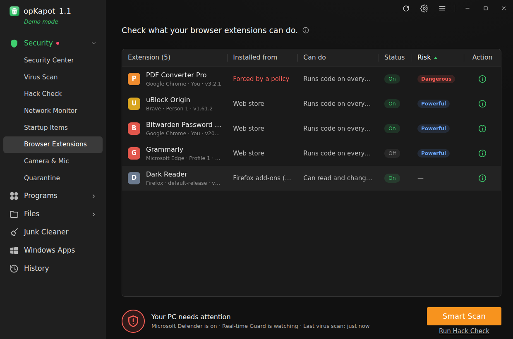 | 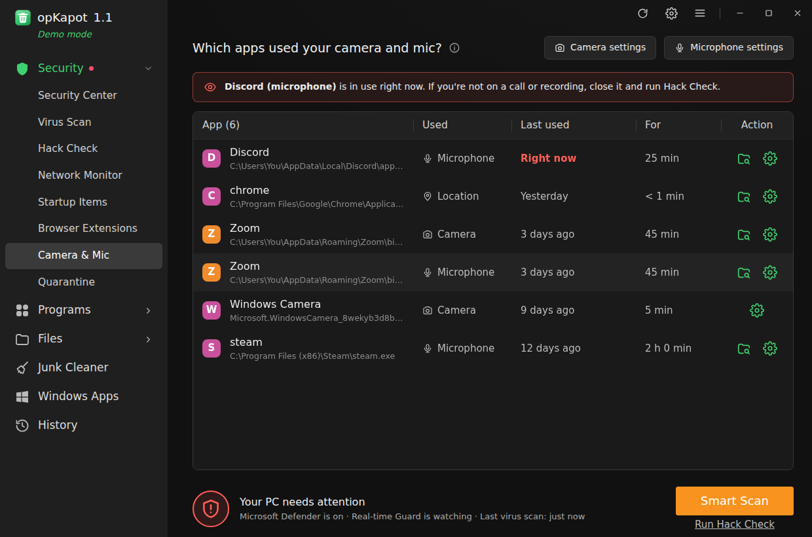 |

## Uninstaller & cleaner

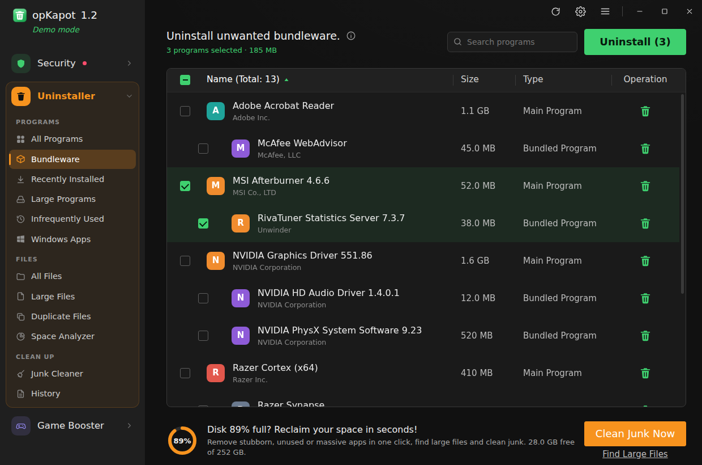


### Programs
- **All Programs**, **Bundleware**, **Recently Installed**, **Large Programs** and **Infrequently Used** views.
- Sort any column (name, size, install date, version, last used). Search by name or publisher.
- **Batch uninstall**: tick as many programs as you like and remove them in one go.
- **Bundleware detection** finds programs installed together with another one. It links programs that share a publisher, were installed at the same moment, or sit inside another program's folder.
- **Infrequently Used** uses Windows Prefetch launch data to show programs you haven't opened in 60+ days.
- Right-click menu: Uninstall, **Force remove** (for broken uninstallers), open the install folder, search online, and Properties (registry key, uninstall command and more).

### Uninstall wizard
1. Optional **System Restore point** before anything changes.
2. Runs each uninstaller in turn. Optional **silent mode** covers MSI, Inno Setup and `QuietUninstallString`.
3. Waits for uninstallers that hand off to helper processes (Inno Setup and NSIS copy themselves to `%TEMP%`), with a **Skip waiting** button.
4. **Leftover scan** finds matching folders in Program Files, ProgramData and AppData, Start menu and desktop shortcuts, and registry keys under `HKCU/HKLM\Software`.
5. You review the leftovers before anything is deleted. Exact matches are pre-ticked; shared-looking items are marked **Review**. Registry keys are exported to a `.reg` backup before they are deleted.

### Windows Apps
- Lists Microsoft Store and pre-installed apps (AppX) with their size, and removes several at once. System-critical apps are hidden.

### Files
- **All Files**: recursive scan of any drive or folder with filters for size, type (video, audio, pictures, documents, archives, installers…) and age. Results are sortable and can be deleted in bulk.
- **Large Files**: the same scanner, pre-set to find big files on your system drive.
- **Duplicate Files**: compares file contents (size, then a partial hash, then a full SHA-1). **Auto-select** can keep the newest, oldest or shortest-path copy. The app never deletes every copy of a file.
- **Space Analyzer**: shows how much space each folder uses, with share bars. Double-click a folder to drill down.
- Scans run in a background thread, the tables are virtualised (hundreds of thousands of rows stay smooth), and you can stop a scan at any time and keep the partial results.

### Junk Cleaner
Covers user and Windows temp files, the Windows Update cache, error reports and crash dumps, browser caches (Chrome, Edge, Brave, Vivaldi, Opera, Firefox), DirectX/GPU shader caches, thumbnail cache, Delivery Optimization files, old logs, Prefetch data and the Recycle Bin. Temp files newer than 24 hours (configurable) and files in use are skipped.

### Also
- **History** of everything removed and how much space it freed.
- **Settings**: Recycle Bin or permanent delete, restore points, silent mode, automatic leftover removal, system components, scan exclusions and the temp-file age limit.
- Keyboard shortcuts: `F5` refresh, `Ctrl+F` search, `Ctrl+A` select all, `Delete` uninstall or delete the selection, `Esc` close dialogs.

| | |
|---|---|
| 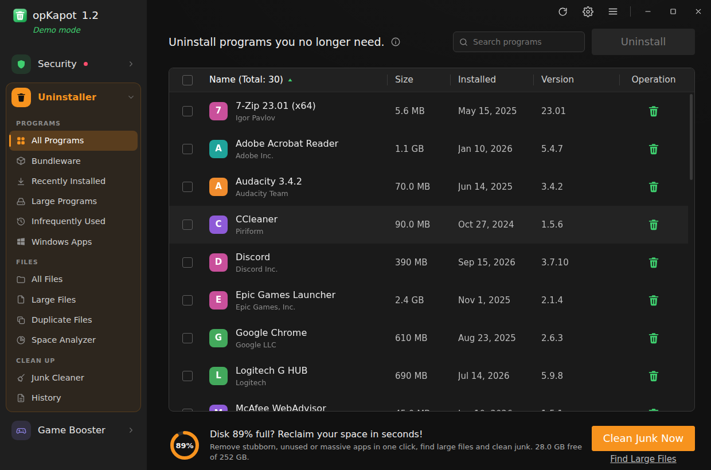 | 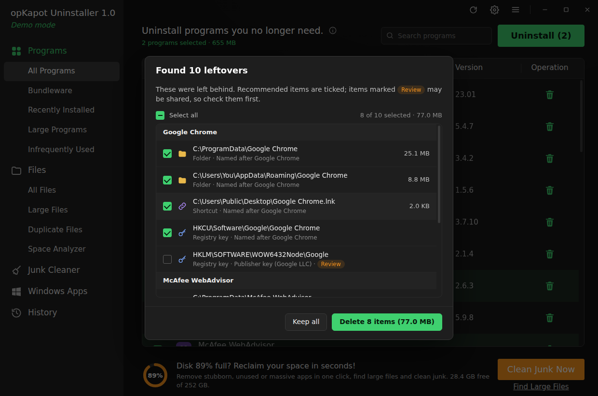 |
| 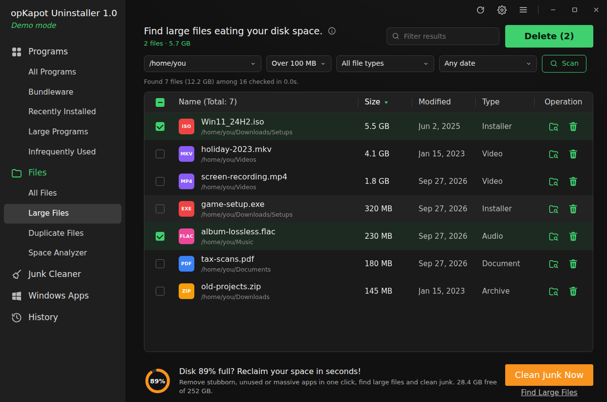 | 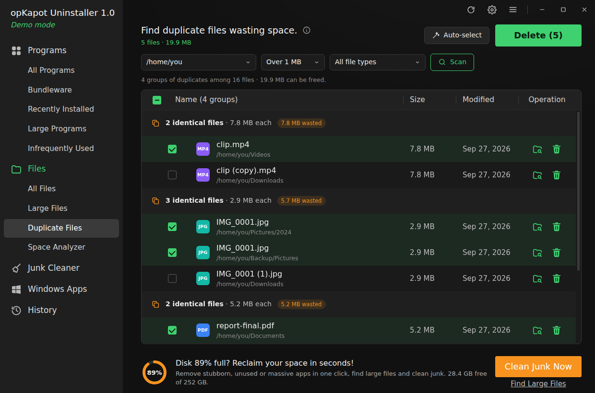 |
| 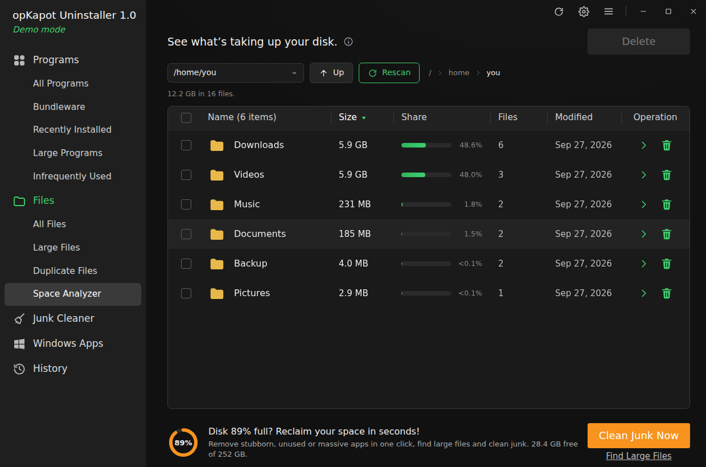 | 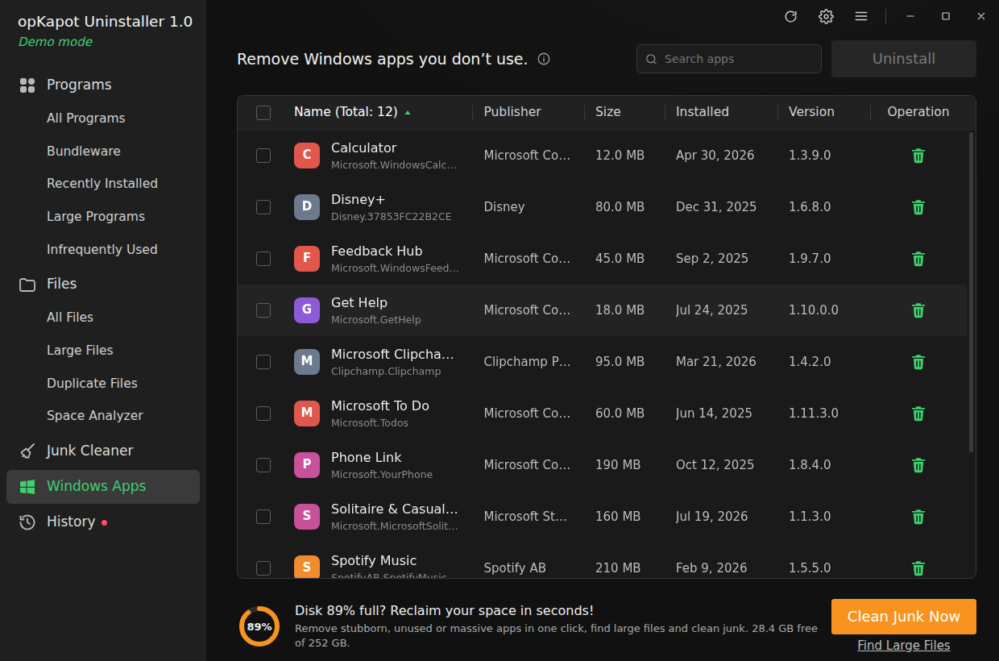 |

## Safety

Deleting things is serious, so several guards are built in:

- **Protected paths.** The app refuses to delete drive roots, `C:\Windows` (except Temp, Minidump, LiveKernelReports and the Update download cache), Program Files and ProgramData roots, your user profile folders, `pagefile.sys` and similar files. The same rule blocks deleting any folder that contains one of these.
- **Leftovers never overlap other programs.** A folder is not offered if it is, or contains, another installed program's folder. A publisher folder is only offered when no other installed program comes from that publisher.
- **Registry.** Shared keys (`Microsoft`, `Classes`, `Policies`, `Windows`, …) can never be deleted. Every deleted key is backed up to `%APPDATA%\opKapot Uninstaller\registry-backups`.
- Files go to the **Recycle Bin** by default, and every delete asks for confirmation first.
- **Security checks are read-only.** Only a separate, fixed set of actions can change anything (turn a protection on, disable a startup item, remove a policy, block a program), and each one asks first. Registry changes are exported to a `.reg` backup before they happen. The PowerShell scripts are passed to PowerShell in memory, not written to a temp file that something else could swap.
- **Quarantined files** are scrambled on disk so they can't run, and restored byte for byte if you change your mind.

## Download and run

### Windows (recommended)
1. Download **[opKapot-Uninstaller-Portable-1.1.0.exe](release/opKapot-Uninstaller-Portable-1.1.0.exe)** (open the link, then click **Download raw file**). It's portable, so there's nothing to install.
2. Double-click it. Windows SmartScreen may say *"Windows protected your PC"* because the app isn't code-signed: click **More info → Run anyway**.
3. Click **Yes** when Windows asks for administrator permission. Uninstalling programs, cleaning Windows folders and the security checks need it.

The first launch takes a few seconds while the portable exe unpacks itself. Put the exe somewhere permanent (for example `Documents\opKapot`) before you turn on **Settings → Start protection when Windows starts**, because Windows will launch it from that spot.

Closing the window while the Real-time Guard is on keeps opKapot running in the notification area. Right-click the tray icon to quit.

The **Build** GitHub Actions workflow also produces an installer (`opKapot-Uninstaller-Setup-x.y.z.exe`) and a fresh portable exe. Once Actions is enabled for the repository, download them from a workflow run's **Artifacts** section.

### Build from source
Requires Node.js 20+.

```bash
npm install
npm start          # run the app
npm run demo       # run with sample programs (see below)
npm test           # unit tests
npm run dist:win   # build the Windows installer + portable exe into dist/ (run on Windows)
```

### Demo mode
`npm run demo` (or `--demo`) fills **Programs**, **Windows Apps** and every **Security** view with a sample PC (including a few planted problems) and only simulates uninstalls and fixes, so you can try the UI safely on any OS. **Files** and **Junk Cleaner** still work on your real disk in demo mode. They always ask before deleting anything.

## Platform support
- **Windows 10/11**: full feature set. Programs are read from the registry (64-bit, 32-bit and per-user). Security features need Windows.
- **Linux**: APT, Flatpak and Snap packages; Files and Junk Cleaner.
- **macOS**: apps in `/Applications` (uninstall moves them to the Trash); Files and Junk Cleaner.

## Project layout

```
src/main/                 Electron main process
  main.js, preload.js, ipc.js
  lib/                    process helpers, path & registry safety, command-line parsing
  services/programs/      Windows registry, Linux and macOS providers, bundleware grouping, demo data
  services/leftovers.js   leftover finder
  services/junk.js        junk categories
  services/windowsApps.js AppX packages
  security/ps/            read-only PowerShell collectors + actions.ps1 (the only script that changes anything)
  security/analyze/       pure functions that turn collected data into findings
  security/service.js     virus scan, Hack Check, network, startup, quarantine, VirusTotal, Real-time Guard
  workers/scan-worker.js  file scans, duplicate hashing, folder sizes, junk scan/clean, malware heuristics (worker thread)
  workers/heuristics.js   opKapot's own detection rules
src/renderer/             UI (plain ES modules, no framework)
  js/components/table.js  virtualised, sortable, multi-select table
  js/views/               one module per sidebar section (js/views/security/ for Security)
test/                     node:test unit tests
```
